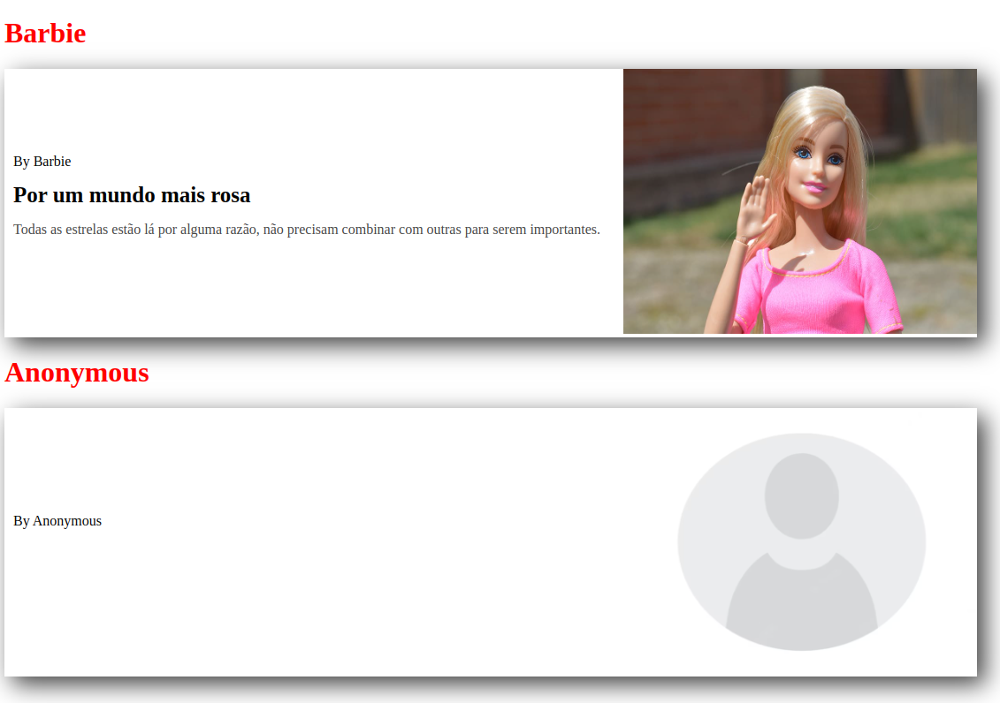

# componentes-estudo-DIO
### Trabalhando com Web Components no Front-end - DIO
- Estudo
##

 Plataforma : DIO 

 Bootcamp : Santander Bootcamp 2023 - Fullstack Java+Angular 

 Módulo : Ganhando produtividade com Angular 

 Atividade 1 : Trabalhando com Web Components no Front-end 

 

Entendendo e criando componentes com HTML e JavaScript, para compreender os conceitos de componentes.

##
### Tecnologias utilizadas:

   
   
   

##

